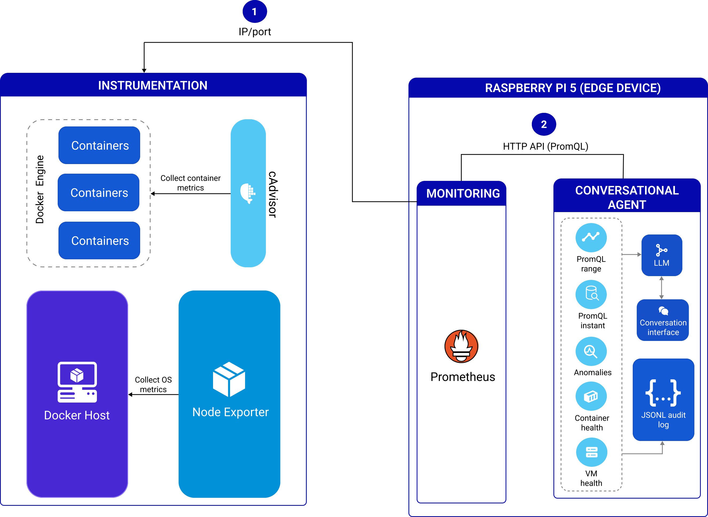
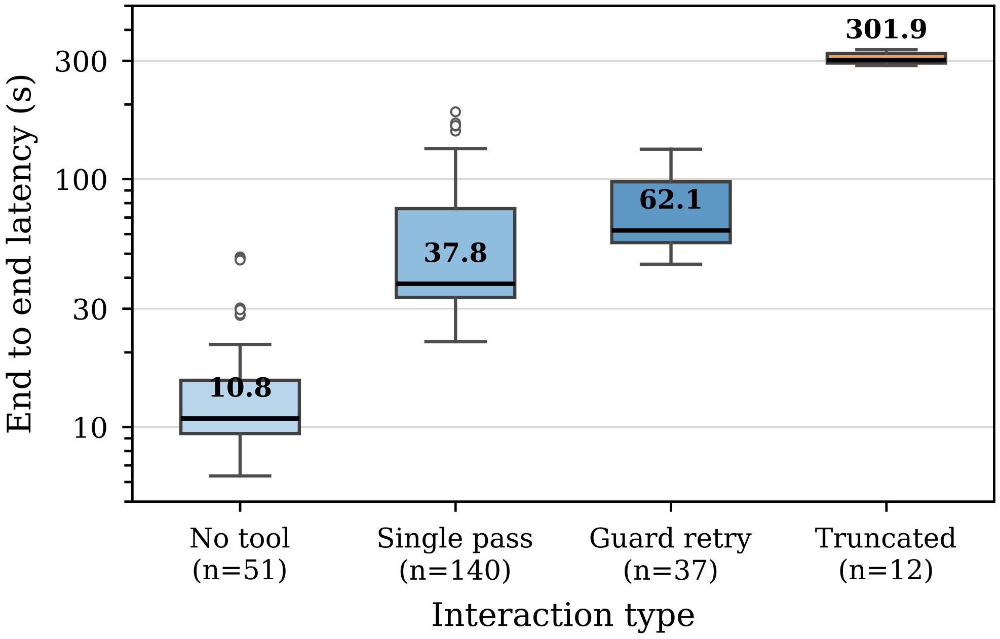
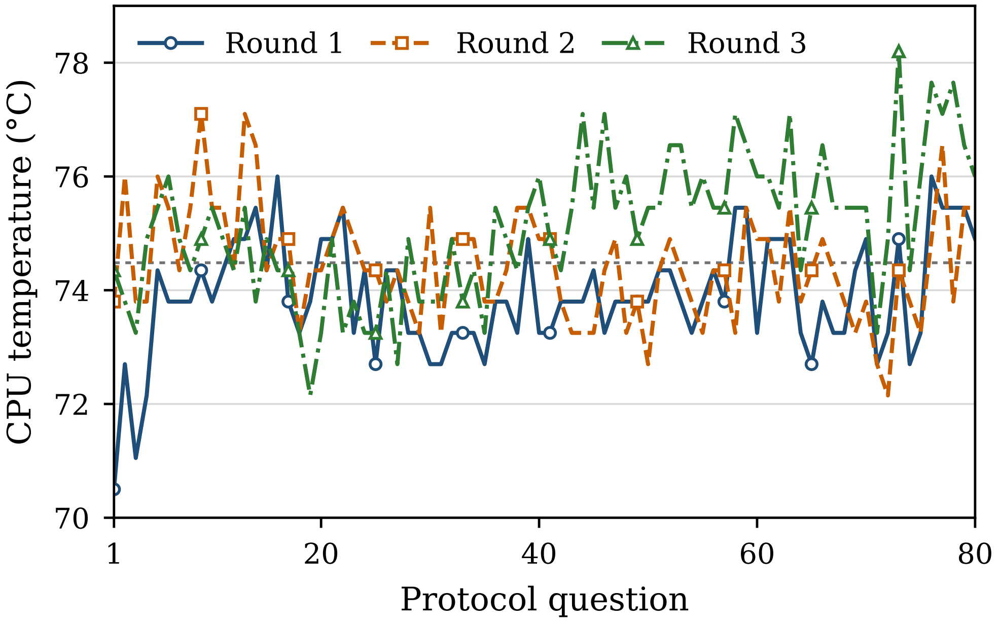

&nbsp;
&nbsp;

<p align="center">
  
</p>

# Grounded Tool Calling for Edge AIoT Observability: A Local SLM-Prometheus Deployment

<p align="center">
  <a href="https://github.com/conect2ai/AIOT2026-prometheus-edge/actions/workflows/tests.yml"></a>
</p>

### Authors: [Erick Justino](https://github.com/erickjustino), Mateus Araujo, [Marianne Silva](https://github.com/MarianneDiniz), [Dennis Brandão](https://scholar.google.com.br/citations?user=OxSKwvEAAAAJ&hl=pt-BR&authuser=1&oi=ao), Emiliano Sisinni, Paolo Ferrari and [Ivanovitch Silva](https://github.com/ivanovitchm)

This repository contains the implementation, the evaluation protocol and the
**published results** of a conversational agent that supports the monitoring
of computing infrastructures through natural-language questions, with the
small language model (SLM, served by Ollama), the LangChain agent and
Prometheus all running on a **Raspberry Pi 5**. Metric collection (Node
Exporter and cAdvisor) runs on the monitored machines; storage, inference and
answering run on the device.

The main goal is to reduce the dependence on manual PromQL queries during
operational investigations. The operator asks questions about virtual machines,
containers, CPU, memory, disk, network usage or anomalies, and the agent selects
the appropriate tool, queries Prometheus and returns an answer grounded in the
observed data. All metrics, topology and answers stay on the local
infrastructure (data locality); the repository does not claim or measure
formal privacy guarantees.

This code is the edge-scenario evolution of an agent first built on a desktop
workstation (see [Comparison with the preliminary desktop deployment](#comparison-with-the-preliminary-desktop-deployment)).
Porting it to the Raspberry Pi 5 required a set of latency, memory,
disk-write and faithfulness optimizations that are described in this README and
in the guide [docs/RASPBERRY_PI.md](docs/RASPBERRY_PI.md).

> **Reproducing the paper:** see [ARTIFACT.md](ARTIFACT.md) for the
> claim → evidence → command table. Short version:
> `python tests/test_porte_edge.py` (software tests, no network/Ollama) and
> `python scripts/reproduzir_tabelas.py` (recomputes the paper tables from
> `resultados/`).

## Overview

The experimental architecture follows three main modules:

1. **Instrumentation** (on the monitored machines): metric collection from
   virtual machines through Node Exporter and from containers through cAdvisor.
2. **Monitoring** (on the Raspberry Pi 5): storage and querying of the time
   series in a local Prometheus, with a 30 s scrape interval, WAL compression
   and metric filtering at ingestion.
3. **Intelligence** (on the Raspberry Pi 5): local SLM-based conversational
   agent (`qwen3:4b-instruct` by default), LangChain, Ollama and asynchronous
   Python tools for querying and interpreting the metrics.

<p align="center">
  
</p>
<p align="center"><em>Figure 1 — Architecture. Node Exporter and cAdvisor run on the monitored Docker hosts (1: scraped by IP/port); Prometheus, the tool-calling agent, the local SLM and the JSONL audit log run on the Raspberry Pi 5 (2: HTTP API / PromQL). Vector version: <a href="./figures/arquitetura.pdf">figures/arquitetura.pdf</a>.</em></p>

The overall flow is:

1. The user submits a natural-language question through the command-line
   interface.
2. The local model interprets the intent and selects a tool, providing the
   environment (`alvo`, target) and the desired scope (`foco`, focus).
3. The tool fires the required PromQL queries **in parallel** against
   Prometheus (with connection pooling, retries and a TTL cache).
4. The returned data is structured and summarized into a lean payload; the
   complete raw data goes to the JSONL telemetry, not into the model context.
5. The agent answers only with information grounded in the collected metrics;
   a runtime faithfulness guard **detects** answers containing numbers (or the
   history marker) when no tool was executed, **retries** the question once
   demanding a tool call, and **warns** the operator if the retry remains
   ungrounded. Each activation is recorded in the telemetry.

## What changes in the edge version

Compared to the preliminary desktop deployment, this version introduces:

| Area | Change | Where |
| --- | --- | --- |
| Collection | Asynchronous HTTP client with keep-alive pool, concurrency semaphore, retry with backoff and TTL cache with aligned timestamps | `services/prometheus.py` |
| Collection | Queries of each health assessment fired in parallel (`asyncio.gather`): latency becomes that of the slowest query, not the sum | `services/metrics.py` |
| LLM context | Lean tool response contract (`status`, `foco`, `alvo`, `answer`); raw data leaves the scratchpad and goes to telemetry | `agent/tools.py` |
| Faithfulness | Faithfulness guard in the CLI: an answer with numbers but no tool executed triggers one retry that forces tool usage; if the issue persists, the answer is delivered with an explicit warning. Activation, recovery and warning are logged (`retentativa_guarda`, `guarda_recuperou`, `aviso_fidelidade_emitido`) | `main.py`, `telemetry/logger.py` |
| Faithfulness | Conversational-memory sanitization: lines with digits are stripped from the saved history, preventing small models from recycling old metrics instead of collecting again | `agent/engine.py` |
| Robustness | Unwrapping of malformed tool arguments (the `{"type": "string", "value": ...}` format emitted by instruct models such as qwen3-instruct-2507), avoiding an extra LLM round | `agent/tools.py` |
| Robustness | Typed exceptions (`AlvoInvalidoError`, `ParametroInvalidoError`) instead of error-string comparison | `core/exceptions.py` |
| Tools | `foco` parameter on the health tools (VM: geral/cpu/memoria/disco/rede; containers: geral/top/cpu/memoria/anomalias), building only the requested summary | `agent/tools.py` |
| Tools | Input validation and sanitization: window/step limits, raw PromQL length limit, container-name regex restricted to safe characters | `agent/tools.py` |
| Inference | Default model `qwen3:4b-instruct` (Q4_K_M), 2048-token context, generation capped at 512 tokens, 4 threads (Pi 5 cores), model resident in RAM (`keep_alive=-1`), *thinking* mode disabled, temperature 0 | `core/config.py`, `agent/engine.py` |
| Telemetry | Automatic logging of every interaction in JSONL: tools, parameters, durations, raw data, prefill and decode tokens/s, decomposed latencies, Pi temperature and throttling register, guard flags | `telemetry/logger.py` |
| Evaluation | Unattended protocol runner (N rounds, one JSONL per round), automatic evaluator (PASS/FAIL/REVISAR) and paper-table reproduction, all standard library | `scripts/` |
| Tests | Functional tests runnable **without network and without Ollama**, using `httpx`, `langchain_core`, `langchain_ollama` and `langchain_classic` stubs | `tests/` |
| Infra | Prometheus tuning (30 s scrape, compressed WAL, `metric_relabel_configs` to store only the queried metric families; retention at the Prometheus defaults during the evaluated rounds, 3 d / 1 GB as a post-experiment recommendation). Ollama service at its defaults (no systemd override in the evaluated rounds); all inference parameters are sent per request by the agent | [config/](config/README.md), [docs/RASPBERRY_PI.md](docs/RASPBERRY_PI.md) |

## Repository Structure

```text
.
├── .github/workflows/tests.yml   # CI: software tests + artifact checks
├── agent/                        # prompt, tools, executor and sanitized memory
├── config/                       # device-side configuration (Ollama, Prometheus)
├── core/                         # configuration, exceptions, helpers
├── docs/
│   ├── AMBIENTE.md               # frozen experimental environment
│   ├── RASPBERRY_PI.md           # Raspberry Pi 5 guide
│   └── TUTORIAL_PROTOCOLO_V2.md  # how to run and evaluate protocol v2
├── figures/                      # paper figures (PNG + PDF): architecture, latency, temperature
├── resultados/                   # published results (3 rounds x 80 interactions)
│   ├── rodada_1.jsonl, rodada_2.jsonl, rodada_3.jsonl
│   ├── logs/                     # screen logs of each session
│   ├── avaliacao_rodada_{1,2,3}.csv
│   ├── manual_review.csv
│   ├── resumo_artigo.csv
│   └── README.md
├── scripts/
│   ├── rodar_protocolo.py        # runs the 80-question protocol, N rounds
│   ├── avaliar_protocolo.py      # automatic evaluator (Acc_t, F_resp, R_ctx, retry)
│   ├── reproduzir_tabelas.py     # recomputes the paper tables
│   ├── agregar_resultados.py     # latency / tokens-per-second statistics
│   └── gabarito_v2.json          # machine-readable answer key (80 questions)
├── services/                     # Prometheus client and metric consolidation
├── telemetry/                    # JSONL logger and LangChain callback
├── tests/                        # offline tests + stubs
├── ARTIFACT.md                   # claim -> evidence -> command
├── CHANGELOG.md
├── CITATION.cff
├── Makefile
├── main.py
├── perguntas-monitoramento.md    # protocol v1 (30 questions, preliminary desktop work)
├── perguntas-monitoramento-v2.md # protocol v2 (80 questions, this paper)
├── requirements.txt
└── README.md
```

## Files

- `main.py`: command-line interface of the agent, with the asynchronous
  conversation loop, telemetry coupling and the faithfulness guard
  (`aplicar_guarda_fidelidade`).
- `agent/engine.py`: lazy creation of the local LLM, prompt, conversational
  memory with number sanitization and the LangChain executor.
- `agent/prompt.py`: system instructions, tool-usage rules and
  anti-hallucination constraints (experimentally calibrated).
- `agent/tools.py`: tools exposed to the agent (VM, containers, anomalies and
  raw PromQL), with parameter validation, argument unwrapping and a lean
  response contract.
- `core/config.py`: environment variables, operational thresholds, catalog of
  monitored targets (with aliases) and configuration validation at import time.
- `core/exceptions.py`: typed exceptions of the agent.
- `core/utils.py`: helper functions for formatting, mean, maximum and
  threshold-based classification.
- `services/prometheus.py`: asynchronous HTTP client for the Prometheus API
  (keep-alive pool, retry with backoff, concurrency limit, TTL cache,
  timestamp alignment) and result extractors.
- `services/metrics.py`: parallel PromQL queries and consolidation of VM and
  container metrics, without masking collection failures as an ok state.
- `telemetry/logger.py`: per-interaction JSONL logging (tools, raw data,
  prefill and decode tokens/s, latencies, Pi sensors and guard flags) via a
  LangChain callback.
- `scripts/rodar_protocolo.py`: runs protocol v2 unattended for N rounds,
  feeding `main.py` through stdin exactly as an operator would, opening a
  fresh session where the protocol requires it, and writing
  `resultados/rodada_N.jsonl` plus screen logs.
- `scripts/avaliar_protocolo.py`: automatic evaluation of protocol v2 —
  cross-references the telemetry with the answer key and computes Acc_t,
  F_resp, R_ctx and the retry rate per round, category and origin (v1 × v2).
- `scripts/reproduzir_tabelas.py`: recomputes the paper tables from the
  published JSONL and `resultados/manual_review.csv`.
- `scripts/agregar_resultados.py`: consolidates a telemetry file into CSV and
  prints summary statistics (latencies and tokens/s).
- `scripts/gabarito_v2.json`: machine-readable answer key of protocol v2
  (expected tool, target, focus and behavior per question).
- `tests/test_porte_edge.py`: functional tests runnable without network/Ollama
  (with stubs in `tests/stubs/`).
- `config/`: Ollama and Prometheus configuration used on the device
  ([config/README.md](config/README.md)).
- `docs/RASPBERRY_PI.md`: complete guide for running on the Raspberry Pi 5.
- `docs/TUTORIAL_PROTOCOLO_V2.md`: step-by-step guide to run and evaluate
  protocol v2 on the Raspberry Pi 5.
- `docs/AMBIENTE.md`: frozen versions and parameters of the experimental
  environment.
- `perguntas-monitoramento.md`: 30-question protocol used in the preliminary
  desktop deployment (v1), kept intact as a subset of v2.
- `perguntas-monitoramento-v2.md`: 80-question protocol used in this paper.
- `requirements.txt`: Python dependencies of the project.

## Approach

The agent was designed as an interpretive layer between the operator and
Prometheus. Instead of exposing only raw values, the system organizes the data
into short, operational answers, indicating overall state, averages, peaks and
degradation signals.

Running the model locally keeps operational data on the local infrastructure:
metrics, topologies and answers are not sent to external providers. In the
edge scenario, storage, inference and answering reside on the same device,
while collection (Node Exporter, cAdvisor) runs on the monitored machines.

### Mechanisms against metric hallucination

Small models, viable on ARM CPUs, tend to "recycle" numbers from the history
instead of executing a fresh collection (*context recycling*). The edge version
fights this in three layers:

1. **System prompt**: explicitly forbids answering with numbers without
   executing a tool for the current question; the history is used only to
   inherit the last mentioned environment.
2. **Number-free memory** (`agent/engine.py`): before saving a turn to the
   history, every line containing digits is removed and replaced by a marker.
   With no numbers in the context, there is nothing to recycle. The memory
   window is short (1 turn by default), which also limits KV-cache growth
   between questions.
3. **Runtime faithfulness guard** (`main.py`): if the final answer contains
   digits (or mimics the history marker) and the telemetry records **zero**
   tools executed in the interaction, the agent re-asks the question demanding
   tool usage; if the problem persists, the answer is delivered with an
   explicit faithfulness warning to the operator. The guard writes
   `retentativa_guarda`, `guarda_recuperou` and `aviso_fidelidade_emitido`
   to the JSONL so that the evaluator does not need to infer activations.

The guard catches recycled **numbers**; as discussed in the paper, it cannot
catch recycled **qualitative** statements ("no anomaly detected") produced
without a tool call — those are visible in the telemetry and counted as
failures by the evaluator.

### Lean payload and auditable telemetry

The tools return to the LLM only `status`, `foco`, `alvo` and `answer` (the
final, already formatted text). The raw query data does **not** enter the model
context — it is forwarded to the telemetry module, which persists it in JSONL
for faithfulness auditing. This reduces context consumption and prefill time,
the dominant bottleneck on ARM CPUs, without giving up the auditability
required by the experimental protocol.

### Agent Tools

| Tool | Purpose | Main parameters |
| --- | --- | --- |
| `tool_obter_saude_vm` | Overall health or a specific metric of the virtual machine. | `alvo`, `janela_segundos`, `foco` ∈ {geral, cpu, memoria, disco, rede} |
| `tool_obter_saude_containers` | Health, CPU, memory, ranking and anomalies of containers. | `alvo`, `janela_segundos`, `regex_nome`, `foco` ∈ {geral, top, cpu, memoria, anomalias} |
| `tool_detectar_anomalias` | Consolidates warning signals from the VM and the containers. | `alvo`, `janela_segundos` |
| `prom_consulta_instantanea` | Executes raw PromQL through `/api/v1/query`. | `promql` |
| `prom_consulta_range` | Executes raw PromQL through `/api/v1/query_range`. | `promql`, `janela_segundos`, `passo_segundos` |

All tools require an explicit target (`alvo`: `site` or `testes`; aliases such
as `teste`, `homolog` and `homologação` are accepted). When the target cannot
be determined from the message or the recent history, the agent asks the
operator instead of assuming a default. Inputs go through limit validation
(maximum window, maximum step, maximum PromQL length) and the container
`regex_nome` is sanitized to a safe character subset before being interpolated
into the query.

### Queried Metrics

| Resource | Prometheus metrics |
| --- | --- |
| VM CPU | `node_cpu_seconds_total` |
| VM memory | `node_memory_MemAvailable_bytes`, `node_memory_MemTotal_bytes` |
| VM disk | `node_filesystem_avail_bytes`, `node_filesystem_size_bytes` |
| VM network | `node_network_receive_bytes_total`, `node_network_transmit_bytes_total`, `node_network_receive_errs_total`, `node_network_transmit_errs_total` |
| Container CPU | `container_cpu_usage_seconds_total` |
| Container memory | `container_memory_usage_bytes` |
| Recent container state | `container_last_seen` |

At the edge, Prometheus is configured to **store only these metric families**
(via `metric_relabel_configs` with `action: keep`), which drastically reduces
cAdvisor ingestion — cAdvisor exports hundreds of series per container — and
saves RAM and microSD writes. See [config/](config/README.md) and
[docs/RASPBERRY_PI.md](docs/RASPBERRY_PI.md).

## Experiment Telemetry

With `TELEMETRY_ENABLED=true` (default), every interaction with the agent
produces **one append-only JSON line** (`TELEMETRY_FILE`, default
`resultados/experimentos.jsonl` for ad-hoc runs; `scripts/rodar_protocolo.py`
writes each protocol round to `resultados/rodada_N.jsonl`), containing:

- question, final answer, error (if any) and end-to-end latency;
- triggered tools, parameters and duration of each one (auditable **Acc_t**);
- raw data returned by the Prometheus queries (auditable **F_resp**);
- Ollama inference metrics per LLM call (`prompt_eval_count`, `eval_count`,
  durations and `done_reason`), from which **prefill tokens/s** and **decode
  tokens/s** are derived;
- faithfulness-guard flags (`retentativa_guarda`, `guarda_recuperou`,
  `aviso_fidelidade_emitido`);
- Raspberry Pi CPU temperature (sysfs) and throttling register (`vcgencmd`),
  when available (**R_ctx** remains auditable through the parameter history
  across lines).

The JSONL format was chosen because it is crash-resistant (each line is
independent), produces minimal sequential writes (preserving the microSD) and
is directly auditable.

To consolidate a telemetry file into CSV and statistics (mean, median and p95
of latencies and tokens/s):

```bash
python scripts/agregar_resultados.py resultados/rodada_1.jsonl
```

## Comparison with the preliminary desktop deployment

An earlier desktop deployment, built during the development of this work,
serves as a **reference point rather than a controlled baseline**, since
platform, model and protocol all differ (paper, Section IV-B and Table III):

| | Desktop (preliminary) | This work (edge) |
| --- | --- | --- |
| Device | Intel Core i7, 64 GB RAM, NVIDIA RTX 4070 | Raspberry Pi 5, 16 GB RAM |
| Inference | GPU-accelerated | CPU only, 4 threads (Cortex-A76) |
| Model | Qwen3-14B | Qwen3-4B-Instruct, Q4_K_M quantization |
| Context window / max generation / reasoning | default profile | 2,048 tokens / 512 tokens / disabled |
| Protocol | 30 routine questions ([perguntas-monitoramento.md](perguntas-monitoramento.md)) | 80 questions: 30 routine + 50 adversarial ([perguntas-monitoramento-v2.md](perguntas-monitoramento-v2.md)) |
| Rounds | exploratory sessions | 3 independent rounds |
| Reliability mechanisms | absent | enabled (sanitized memory, faithfulness guard, lean payload) |
| Scrape interval / retention | 15 s / default | 30 s / default (15 days, no size limit), compressed WAL |
| Performance metrics | resource usage | latency, throughput, thermal behavior, retry rate |

The desktop deployment scored **100 %** on the same 30 routine questions; the
edge deployment scored 73.3 % tool-selection accuracy, 80.0 % response
fidelity and 40.0 % context retention on them. Because the deployments differ
in platform, model and protocol, these numbers **contextualize each other but
do not support causal attribution** to any single factor (paper, Section VI).
The system prompt was calibrated during the desktop deployment, before the
adversarial questions were authored.

## Evaluation Protocol

The edge experiment uses the **80-question protocol v2**
([perguntas-monitoramento-v2.md](perguntas-monitoramento-v2.md)): the 30
questions of the preliminary desktop work (v1, kept intact as a subset for
comparability) plus 50 new questions covering seven adversarial categories —
context anti-recycling, out-of-scope/refusal, ambiguity and multiple targets,
abbreviations and typographical errors, existing/nonexistent containers, raw
PromQL and long context chains. *Adversarial* denotes requests designed to
stress the agent's decision rules, not malicious intent.

| Metric | Definition |
| --- | --- |
| `Acc_t` | Correct selection of the tool and parameters for each question. |
| `F_resp` | Faithfulness of the answer values with respect to the raw Prometheus data (5 % tolerance). |
| `R_ctx` | Context retention in multi-turn interactions (target inheritance). |
| `R_retry` | Interactions in which the faithfulness guard triggered a retry (explicit flag `retentativa_guarda`), over the 68 tool-expecting questions per round. |

The evaluation is automatic: `scripts/avaliar_protocolo.py` cross-references
the JSONL telemetry with the answer key (`scripts/gabarito_v2.json`) and emits
**PASS/FAIL/REVISAR** (review) verdicts per round, category and origin
(v1 × v2) — borderline cases receive REVISAR and never count as correct
without manual auditing of the JSONL. The manual decisions are recorded in
[resultados/manual_review.csv](resultados/manual_review.csv), one row per
REVISAR interaction with a pointer to the raw line. The complete step-by-step
procedure (rounds, fresh sessions, validity criteria and auditing) is in
[docs/TUTORIAL_PROTOCOLO_V2.md](docs/TUTORIAL_PROTOCOLO_V2.md).

## Results

All numbers below are recomputed from the published JSONL by
`python scripts/reproduzir_tabelas.py` (see [resultados/](resultados/README.md)
and [ARTIFACT.md](ARTIFACT.md)). Three valid rounds covered the 240 planned
interactions; the evaluator assigned PASS/FAIL to 199 interactions and REVISAR
to 41, of which manual review classified 35 as correct and 6 as incorrect.
With temperature 0 and a fixed order, every question produced the same tool
sequence and verdict across rounds.

| Question set | n | Acc_t | F_resp | R_ctx | R_retry (mean of rounds) |
| --- | --- | --- | --- | --- | --- |
| Routine (v1) | 30 | 73.3 % | 80.0 % | 40.0 % | 24.1 % |
| Adversarial (v2) | 50 | 68.0 % | 88.0 % | 63.6 % | 21.4 % |
| All questions | 80 | 70.0 % | 85.0 % | 56.2 % | 22.5 % |

Highlights (paper, Section V):

- Per-resource VM queries were fully correct; the main weaknesses were
  existing/nonexistent containers (16.7 % accuracy), ambiguity (33.3 %) and
  long context chains (62.5 %). Most failures involved malformed targets, an
  assumed target when clarification was required, or qualitative context
  recycling without a tool call.
- **Faithfulness guard:** retried 15, 15 and 16 of the 68 eligible
  interactions per round (22.5 ± 0.7 %); every activation recovered on the
  first retry and the fallback warning was never needed. No reported number
  contradicted the recorded raw data.
- **Device performance:** mean end-to-end latency 61.6 ± 0.6 s across rounds
  (pooled median 38.4 s, range 6.3–332.7 s); model prefill and decoding
  accounted for 98.7 % of the latency, tools for 0.01 %. Pooled medians by
  interaction type: 10.8 s without a tool, 37.8 s for one tool pass, 62.1 s
  with a guard retry, 301.9 s for the 12 answers truncated at the 512-token
  limit. Mean prefill throughput 212.6 ± 0.6 tokens/s, decode 2.74 ± 0.02
  tokens/s. CPU temperature averaged 74.5 ± 0.5 °C (70.5–78.2 °C); the
  throttling register stayed at `0xE0000` (historical bits only, no active
  throttling) during the 4.1 h of execution.
- The direct PromQL range request exceeded the 2,048-token context window in
  every round (recorded as an error in the telemetry).

<p align="center">
  
</p>
<p align="center"><em>Figure 2 — End-to-end latency by interaction type across the three rounds (pooled medians; log scale). Reproduce the numbers with <code>python scripts/reproduzir_tabelas.py</code> (section <code>LATENCIA POR TIPO DE INTERACAO</code>). Vector: <a href="./figures/latencia_por_tipo.pdf">figures/latencia_por_tipo.pdf</a>.</em></p>

<p align="center">
  
</p>
<p align="center"><em>Figure 3 — CPU temperature across the three protocol rounds (dotted line: overall mean of 74.5 °C). Source field: <code>sistema.cpu_temp_c</code> in each JSONL line. Vector: <a href="./figures/temperatura_cpu.pdf">figures/temperatura_cpu.pdf</a>.</em></p>

Published files: [resultados/rodada_1.jsonl](resultados/rodada_1.jsonl),
[rodada_2.jsonl](resultados/rodada_2.jsonl),
[rodada_3.jsonl](resultados/rodada_3.jsonl),
[avaliacao_rodada_{1,2,3}.csv](resultados/),
[manual_review.csv](resultados/manual_review.csv),
[resumo_artigo.csv](resultados/resumo_artigo.csv).

## Software tests vs. scientific reproduction

These are two different things:

- **Software tests** (`python tests/test_porte_edge.py`) validate components of
  the software without network or Ollama (target resolution, tool contracts,
  Prometheus client, telemetry, sanitized memory, the three faithfulness-guard
  paths, the evaluator on fixtures, and the integrity of the published files:
  80 lines per round, 15/15/16 retries). They **do not** re-run the 240
  interactions nor prove the paper metrics.
- **Scientific reproduction** (`python scripts/reproduzir_tabelas.py`)
  recomputes the tables of the paper from the published JSONL and the manual
  review file, on any machine, with the standard library only.
- **Re-running the experiment** requires the Raspberry Pi 5 setup described
  below and in [docs/RASPBERRY_PI.md](docs/RASPBERRY_PI.md).

## How to Run

### 1. Clone the repository

```bash
git clone https://github.com/conect2ai/AIOT2026-prometheus-edge.git
cd AIOT2026-prometheus-edge
```

### 2. Create the Python environment

Create the virtual environment, activate it and install the dependencies:

```bash
python -m venv .venv
```

On Linux/macOS:

```bash
source .venv/bin/activate
```

On Windows PowerShell:

```powershell
.\.venv\Scripts\Activate.ps1
```

Then install the dependencies:

```bash
python -m pip install --upgrade pip
pip install -r requirements.txt
```

The exact versions used on the device are frozen in `requirements.lock.txt`
and [docs/AMBIENTE.md](docs/AMBIENTE.md); to regenerate after validating the
environment on the Raspberry Pi:

```bash
pip freeze > requirements.lock.txt
```

### 3. Install Ollama and pull the model

The project uses the `qwen3:4b-instruct` model by default (suited to the edge):

```bash
ollama pull qwen3:4b-instruct
```

To use another tool-calling-capable model (for example, the `qwen3:14b` of the
preliminary desktop deployment), set the `OLLAMA_MODEL` environment variable.

### 4. Prepare Prometheus

The agent expects to find Prometheus at:

```text
http://localhost:9090
```

If Prometheus is at another address, set:

On Linux/macOS:

```bash
export PROMETHEUS_URL="http://YOUR_HOST:9090"
```

On Windows PowerShell:

```powershell
$env:PROMETHEUS_URL="http://YOUR_HOST:9090"
```

The monitored targets are defined in `core/config.py`:

| Target | Node Exporter job | cAdvisor job |
| --- | --- | --- |
| `site` | `vm_site_conect2ai` | `containers_vm_site_conect2ai` |
| `testes` | `vm_testes` | `containers_vm_testes` |

These names must match the `job_name` entries configured in `prometheus.yml`
(evaluated configuration, with placeholders: `config/prometheus-edge.yml`). The edge tuning of
Prometheus (scrape interval, WAL, metric filtering at ingestion, retention and
cAdvisor adjustments on the monitored VMs) is documented in
[config/README.md](config/README.md) and [docs/RASPBERRY_PI.md](docs/RASPBERRY_PI.md).

### 5. Run the agent

With the virtual environment active, Ollama available and Prometheus
reachable, run:

```bash
python main.py
```

The command-line interface will start (output in Portuguese):

```text
=====================================================
Agente Iniciado!
Modelo local: qwen3:4b-instruct
Monitorando Prometheus em: http://localhost:9090
Telemetria do experimento: .../resultados/experimentos.jsonl
Digite 'sair' para encerrar.
=====================================================
```

To quit, type `sair` (or `exit`/`quit`).

## Running on the Raspberry Pi 5 (Edge)

The agent defaults **are already the Raspberry Pi 5 ones** (`qwen3:4b-instruct`,
Prometheus at `localhost:9090`, 4 inference threads, 2048-token context,
telemetry enabled) — no environment variable needs to be set for the edge
scenario. The guide [docs/RASPBERRY_PI.md](docs/RASPBERRY_PI.md) covers the
complete procedure:

- operating-system preparation (zram instead of disk swap, `noatime`);
- Ollama installation (the evaluated rounds used the service defaults; a
  systemd override with quantized `q8_0` KV-cache, flash attention and one
  model at a time is documented as an optional recommendation);
- Prometheus from the official tarball in `/opt/prometheus`, started without
  storage flags (30 s `scrape_interval`, compressed WAL by default,
  `metric_relabel_configs` to store only the metric families queried by the
  agent; retention limits as a post-experiment recommendation);
- cAdvisor load reduction on the monitored VMs;
- post-port validation checklist, including re-applying the 80-question
  protocol and tracking temperature/throttling through the telemetry.

## Tests

The functional tests run **without network and without Ollama**:

```bash
python tests/test_porte_edge.py
```

When `httpx`, `langchain_core`, `langchain_ollama` and `langchain_classic` are
not installed, the tests use minimal stubs included in `tests/stubs/`
(configurable through the `STUBS_DIR` environment variable); with the real
dependencies installed, the same tests run against them. The suite covers
target and alias resolution, parameter validation and typed exceptions, tool
response assembly, the Prometheus client (cache, retry, extractors), the
telemetry, the number-free memory, the three paths of the faithfulness guard
(no activation / recovery on first retry / final warning), the evaluator
(Acc_t, F_resp, R_ctx and retry from fixtures; explicit flag vs. heuristic;
multi-tool questions not mistaken for retries; missing, duplicated and
out-of-order logs) and the integrity of the published results. The same
checks run in CI (`.github/workflows/tests.yml`).

## Reproducibility

To recompute the published results (any machine, standard library only):

```bash
python scripts/avaliar_protocolo.py resultados/rodada_1.jsonl --csv resultados/avaliacao_rodada_1.csv
python scripts/avaliar_protocolo.py resultados/rodada_2.jsonl --csv resultados/avaliacao_rodada_2.csv
python scripts/avaliar_protocolo.py resultados/rodada_3.jsonl --csv resultados/avaliacao_rodada_3.csv
python scripts/reproduzir_tabelas.py
```

To re-run the edge experiment, you need to:

1. Prepare the Raspberry Pi 5 following [docs/RASPBERRY_PI.md](docs/RASPBERRY_PI.md)
   (OS, Ollama, local Prometheus with the configuration in [config/](config/README.md)).
2. Configure Node Exporter and cAdvisor on the monitored environments and make
   sure the Prometheus `job_name` entries match the targets defined in
   `core/config.py`.
3. Run the protocol with `python scripts/rodar_protocolo.py` (3 rounds by
   default; one telemetry file per round, fresh sessions where the protocol
   requires), following [docs/TUTORIAL_PROTOCOLO_V2.md](docs/TUTORIAL_PROTOCOLO_V2.md).
4. Evaluate with `scripts/avaliar_protocolo.py` (Acc_t, F_resp, R_ctx and
   retry rate per category), manually audit the REVISAR cases against the
   JSONL (record them in `resultados/manual_review.csv`) and recompute the
   tables with `scripts/reproduzir_tabelas.py`.

Answers must be evaluated considering:

- correct selection of the tool and parameters (`Acc_t`);
- faithfulness of the values with respect to the raw data, with 5 % tolerance
  (`F_resp`);
- context retention across sequential questions (`R_ctx`);
- absence of invented metrics or metrics improperly reused from the history;
- on-device performance: end-to-end latency, prefill and decode tokens/s, CPU
  temperature and absence of active throttling.

## Experiment Questions

The question protocols are in this repository:

- [perguntas-monitoramento-v2.md](perguntas-monitoramento-v2.md) — 80-question
  protocol of the edge experiment (answer key in
  `scripts/gabarito_v2.json`);
- [perguntas-monitoramento.md](perguntas-monitoramento.md) — 30-question
  protocol of the preliminary desktop deployment, kept for reference.

## Configuration

The main environment variables accepted by the project (with the edge-version
defaults) are:

### Prometheus and queries

| Variable | Default | Purpose |
| --- | --- | --- |
| `PROMETHEUS_URL` | `http://localhost:9090` | Prometheus API URL. |
| `PROMETHEUS_TIMEOUT_SECONDS` | `5` | Maximum wait time for HTTP queries (fail fast + retry). |
| `PROMETHEUS_RETRIES` | `2` | Total attempts per query (timeout/connection). |
| `PROMETHEUS_RETRY_BACKOFF_SECONDS` | `0.5` | Wait between retry attempts. |
| `PROMETHEUS_MAX_CONCURRENT` | `4` | Concurrent query limit (avoids competing with the LLM for CPU). |
| `PROMETHEUS_CACHE_TTL_SECONDS` | `30` | Local response cache TTL (0 disables it). |
| `PROMETHEUS_ALIGN_SECONDS` | `30` | Query timestamp alignment, for cache reuse. |
| `DEFAULT_WINDOW_SECONDS` | `300` | Default query window. |
| `DEFAULT_STEP_SECONDS` | `30` | Default step for range queries (matches the 30s scrape). |
| `RATE_WINDOW` | `2m` | Internal `rate()` window (≥ 4× the scrape_interval). |
| `MAX_WINDOW_SECONDS` | `3600` | Maximum allowed window. |
| `MAX_STEP_SECONDS` | `300` | Maximum allowed step. |
| `PROMQL_MAX_LENGTH` | `1200` | Maximum length of a raw PromQL query. |

### Thresholds and containers

| Variable | Default | Purpose |
| --- | --- | --- |
| `CPU_WARN` / `CPU_CRIT` | `85.0` / `95.0` | Warning and critical thresholds for CPU (%). |
| `MEM_WARN` / `MEM_CRIT` | `85.0` / `95.0` | Warning and critical thresholds for memory (%). |
| `DISK_WARN` / `DISK_CRIT` | `85.0` / `95.0` | Warning and critical thresholds for disk (%). |
| `NET_ERR_WARN` | `1.0` | Warning threshold for network errors. |
| `CONTAINER_STALE_SECONDS` | `90` | Time to classify a container as inactive. |
| `REGEX_NAME_MAX_LENGTH` | `80` | Maximum length of the container name filter. |

### LLM and agent

| Variable | Default | Purpose |
| --- | --- | --- |
| `OLLAMA_MODEL` | `qwen3:4b-instruct` | Local model used by the agent (Q4_K_M, ~2.5 GB). |
| `OLLAMA_BASE_URL` | *(empty)* | Ollama URL, if not the local default. |
| `OLLAMA_NUM_CTX` | `2048` | Model context size. |
| `OLLAMA_NUM_PREDICT` | `512` | Token generation limit per answer. |
| `OLLAMA_NUM_THREAD` | `4` | Inference threads (4 = Pi 5 cores; 0 = automatic, recommended off the Pi). |
| `OLLAMA_KEEP_ALIVE` | `-1` | Keeps the model resident in RAM between questions. |
| `OLLAMA_REASONING` | `false` | qwen3 *thinking* mode (disabled at the edge; re-enable to reproduce the desktop). |
| `AGENT_VERBOSE` | `false` | Enables or disables verbose executor logs. |
| `AGENT_MAX_ITERATIONS` | `4` | Maximum agent iterations per question. |
| `AGENT_MEMORY_WINDOW` | `1` | Conversational memory window (retained turns, number-free). |

### Telemetry

| Variable | Default | Purpose |
| --- | --- | --- |
| `TELEMETRY_ENABLED` | `true` | Writes the experiment telemetry in JSONL. |
| `TELEMETRY_FILE` | `resultados/experimentos.jsonl` | Telemetry file path (relative to the project root); the protocol runner sets it to `resultados/rodada_N.jsonl`. |

## Citation

If you use this software or the published artifacts, please cite the paper
(see [CITATION.cff](CITATION.cff); DOI of the archived release to be added
after the `v1.0-aiot2026` tag is deposited on Zenodo):

```text
E. Justino, M. Araujo, M. Silva, D. Brandão, E. Sisinni, P. Ferrari and I. Silva,
"Grounded Tool Calling for Edge AIoT Observability: A Local SLM-Prometheus Deployment", 2026.
```

## About Conect2AI

**Conect2AI** is a research group at the **Federal University of Rio Grande do
Norte (UFRN)** focused on applying Artificial Intelligence and Machine
Learning to areas such as:

- embedded intelligence;
- Internet of Things;
- intelligent transportation systems;
- observability and monitoring of computing infrastructures.

Website: [http://conect2ai.dca.ufrn.br](http://conect2ai.dca.ufrn.br)
